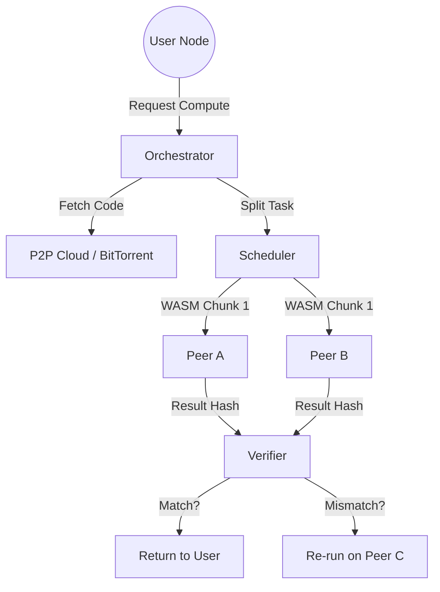

# Implementation Plan: Librenet

Librenet is a vision for a post-centralization web. It replaces the traditional client-server model with a peer-to-peer (P2P) mesh where every participant provides both storage and compute. This architecture leverages a **custom Rust-based rewrite of i2pd (Librenet-Core)** for networking, **TUN/TAP virtual interfaces** for OS-level integration, and a hybrid compute model for both WASM and **Native GPU-accelerated tasks**.

## User Review Required

> [!IMPORTANT]
> **i2pd-based Rust Rewrite**: Our core will be a modern Rust implementation of the `i2pd` (C++) protocol specification, not the Java version. This ensures performance and easier integration with low-level OS networking.
> 
> **Accelerated Compute (AI/GPU)**: For tasks like AI inference and graphics rendering, WASM is often insufficient. We will implement a **Native Compute Provider (NCP)** layer where peers can securely lease their GPU/NPU resources using hardware-isolated containers.
> 
> **IPv6 Mesh Addressing**: Since we are avoiding centralized routers, we propose using a CJDNS-style IPv6 addressing scheme where your IP is derived from your public key. This ensures global uniqueness without a central registry.
> 
> **State Consistency**: Distributed compute is "fast and accurate" for pure functions (stateless). If the compute requires a database or shared state, we need a decentralized consensus layer (like a DAG or blockchain), which can slow things down.

## Architecture Overview

The system is divided into four primary layers:

1.  **Network Layer (The Fabric)**: A custom-built **`librenet-core-rs`** (i2pd spinoff). It provides garlic routing and tunnel building.
2.  **Addressing Layer**: Cryptographic IPv6 addresses. Local network IPs (192.168.x.x) remain untouched, but Librenet addresses (e.g., `fc00::/8`) are routed through the mesh.
3.  **Storage Layer (The Memory)**: A P2P Cloud where files/data are broken into shards and distributed via DHT.
4.  **Compute Layer (Hybrid Distributed SaaS)**: 
    *   **Tier 1 (WASM)**: General application logic (fast, portable).
    *   **Tier 2 (Native NCP)**: High-performance AI, training, and rendering (GPU/NPU required).
5.  **Verification Layer (Consensus)**: Multi-peer verification for WASM and **Proof-of-Computation** (or hardware attestation) for GPU tasks using the **"Tasting the Soup"** analogy.



---

## Proposed Components

### 1. Network Layer: `libre-mesh-tun`
*   **Purpose**: Full encapsulation of the Libre Internet within the OS TCP/IP stack.
*   **Key Features**:
    *   **OS Integration**: Creates a virtual network adapter (`libre0`). Standard POSIX socket calls (`connect`, `send`, `recv`) work natively.
    *   **Latency-Aware Neighborhoods**: The routing protocol prioritizes nodes within a <50ms ping radius for compute and storage. This creates "Local Cells" that feel as fast as the traditional web.
    *   **Firewall Compatibility**: Operates as a userspace daemon that punches through local firewalls while maintaining its own internal peer-based firewall rules.

### 2. SaaS & Compute Layer: `librenet-swarm`
*   **Purpose**: Replacing central servers with equitable peer compute (WASM + Native).
*   **Mechanism**:
    *   **WASM Orchestration**: Standard app logic distributed as WASM chunks.
    *   **Native NCP (Native Compute Provider)**: For AI/Graphics, we use specialized nodes. A user requesting "Stable Diffusion" or "AI Training" will have their task routed to peers with matching hardware (NVIDIA/AMD/TPU).
    *   **GPU Virtualization**: Leveraging technologies like WebGPU (in-WASM) or Secure Enclaves (TEE) for native GPU leasing.
    *   **Verification (Consensus)**: GPU tasks are verified by **"Tasting the Soup"** (matched hardware peers compute the same seed) or via **Zk-SNARKs** to prove computation without re-running.

### 2. Storage Layer: `libre-torrent-cloud`
*   **Purpose**: A server-less, cloud-sided storage system.
*   **Mechanism**:
    *   **Sharding**: Files are split into 1MB blocks.
    *   **Redundancy**: Erasure coding (e.g., Reed-Solomon) ensures data survives even if 30% of peers go offline.
    *   **Warm-Storage Tiering**: The layer monitors access frequency. Popular files automatically trigger more replicas across high-bandwidth nodes, creating a **Decentralized CDN**.
    *   **Provider Equity**: Peers must host $X$ GB of the network's data to be allowed to store $Y$ GB of their own.

### 3. Compute Layer: `wasm-swarm-runtime`
*   **Purpose**: Distributed execution of application logic.
*   **Mechanism**:
    *   **WASM Chunks**: Applications are compiled to WASM. The runtime breaks these into smaller units of work (Actor model).
    *   **Sandboxing**: Wasmtime/Wasmer used to ensure peers cannot be hacked by the code they run.
    *   **Deterministic Execution**: Ensuring that the same input always produces the same binary output for verification.

### 4. Verification: `soup-taster`
*   **Purpose**: "Tasting the soup" (Redundancy check).
*   **Mechanism**:
    *   **Redundancy Factor ($R$)**: Default $R=2$. Two peers compute the same chunk.
    *   **Consensus**: If `Hash(ResultA) == Hash(ResultB)`, the result is accepted.
    *   **Slashing/Reputation**: Peers providing incorrect results lose reputation and are eventually banned from the "equity" pool.

---

## Phase 2: Technical Enhancements

To ensure Librenet is practical and high-performance, the following systems will be integrated:

### 1. Librenet Name Service (LNS)
*   **Mechanism**: A DHT-backed naming system where `.lib` or `.librenet` domains are mapped to cryptographic IPv6 addresses.
*   **Ownership**: Domain records are signed by the owner's public key, preventing censorship or domain hijacking.

### 2. Optimized Direct Transport (ODT)
*   **Mechanism**: A hybrid transport layer. While metadata and handshake occur over I2P (anonymous), high-bandwidth data (streaming, rendering) can upgrade to a direct, encrypted QUIC tunnel between peers.
*   **Safety**: Users can toggle "Paranoid Mode" to force all traffic through I2P hops if anonymity is preferred over speed.

### 3. Proof-of-Contribution (PoC) & Equity
*   **Mechanism**: A non-financial reputation system. Nodes earn "Equity Credits" by:
    *   Hosting sharded data for the network.
    *   Providing compute cycles for WASM/Native tasks.
    *   Successfully "Tasting the Soup" (verifying others).
*   **Benefit**: High-reputation nodes receive faster response times and priority when requesting their own SaaS tasks.
*   **Leech Protection (Dynamic Switching)**: To prevent nodes from becoming "leeches" when the compute kitchen is full (the "Too Many Chefs" cap), the daemon automatically shifts idle resources to **Storage Repair** (re-replicating shards that fall below the redundancy threshold) or **DHT Optimization**. Equity Credits are only awarded for active contribution to *any* layer of the stack.

### 4. Zero-Config Local Mesh
*   **Mechanism**: Integration of `mDNS` for automatic neighbor discovery.
*   **Benefit**: Nodes on the same physical network (LAN) will bypass the global mesh and communicate at local hardware speeds, ensuring Librenet works even if the global internet backbone fails.

### 5. Unified SaaS Manifest (`.lib` format)
*   **Mechanism**: A declarative JSON/YAML format that defines an application's architecture:
    ```yaml
    app: "LibreChat"
    compute:
      wasm_chunks: 5
      redundancy: 3 # "Tasting the soup" factor
    storage:
      volume: 10GB
      shards: 100
    resources:
      gpu: "optional" # For AI-powered summaries
    ```

---

## Security & Vulnerability Mitigation

To ensure Librenet is practically secure against modern threats, the following defenses are integrated:

### 1. Sybil Attack Resistance (Proof-of-Identity-Work)
*   **The Problem**: A single attacker spawning 10,000 nodes to control the "Tasting the Soup" consensus.
*   **The Defense**:
    *   **Resource-Bound Identity**: Creating a new Librenet ID requires a significant one-time Proof-of-Work (PoW) or a "Vouching" system from existing high-PoC nodes.
    *   **VRF Verifier Selection**: Verifiers for a specific task are chosen using a **Verifiable Random Function (VRF)**.
    *   **Reputation Aging (The Burn-In)**: New nodes must "Work for Free" (provide storage/compute) for a 48-hour period before they can earn Equity Credits or access high-value GPU tasks.

### 2. GPU Side-Channel & Determinism
*   **The Problem**: GPUs can be non-deterministic (floating point jitter) and vulnerable to side-channel attacks (stealing data via power/timing).
*   **The Defense**:
    *   **Confidential Computing (TEE)**: For native GPU tasks, Librenet will prioritize nodes with **NVIDIA Confidential Computing** or **AMD SEV-SNP**. This ensures memory is encrypted even from the host peer.
    *   **Fixed-Point / Strict IEEE-754**: For verification ("Tasting the Soup"), the WASM runtime will enforce strict floating-point determinism to ensure that two different GPUs always produce the same bit-level output for the same seed.

### 3. "The Poisoned Soup" Detection
*   **Mechanism**: A "Honey-Pot" task system where the network occasionally sends tasks with known results.
*   **Benefit**: If a node returns a "wrong" result for a honey-pot task, its Proof-of-Contribution is immediately slashed, and it is quarantined from the SaaS compute pool.

---

## Hybrid Architecture & Scoped Soups

Librenet is designed to coexist with the legacy web and respect professional trust requirements.

### 1. Dual-Web Access & On-Ramps
*   **Mechanism**: Librenet nodes can act as **Transparent Gateways**.
    *   **Internal Routing**: Requests for `.lib` or cryptographic IPs stay in the mesh.
    *   **External Routing**: Requests for standard domains (`google.com`) can be routed through "Exit Nodes".
*   **On-Ramp Proxies**: Develop **Libre-Gateways** (HTTP-to-Librenet proxies). Users can visit `app.librenet.io` to interact with the mesh before installing the native `libre0` daemon.
*   **Legacy Fallback**: If a SaaS is better suited for a Client-Server model (e.g., regulated banking), Librenet can route that specific traffic over a traditional encrypted tunnel.

### 2. Scoped Networks (Trust Tiers)
*   **Public Network**: The global decentralized mesh for general web apps and community compute.
*   **Private Network (Enterprise/Medical)**: 
    *   Organizations can create "Locked Networks" where only authorized, SOC2-compliant, or HIPAA-compliant nodes participate.
    *   **Trust Circles**: Peers only contribute to and **"taste the soup"** of groups they are explicitly joined to. A healthcare app would run its compute exclusively on a Private Network of trusted hospital nodes.

### 3. Local Resource Priority (Client First)
*   **Mechanism**: The Librenet daemon uses **Cgroups/Priority Levels** to ensure background **swarm** tasks never lag the user's local experience.
*   **Governance**: 
    *   **Primary Compute**: Your local programs and OS daemons have 100% priority.
    *   **Secondary Compute**: Librenet only uses "Idle cycles." If you launch a game or a heavy AI task locally, Librenet immediately pauses background swarm tasks.

---

## "Libre-Update" Protocol

To ensure Librenet can evolve safely without a central authority, we implement a multi-sig update and versioning system.

### 1. Versioned Content Addressing (LNS Channels)
*   **Mechanism**: Applications are identified by immutable **CIDs** (Content Identifiers), but users track a **Naming Key** (LNS).
*   **Release Channels**: Developers sign a manifest with a "Release Channel" key. When a new CID is signed, nodes following that key automatically pre-fetch the updated WASM shards.

### 2. Epoch-Based Soft Forks
*   **Problem**: Mismatched versions cause "Soup Tasters" to see false-positives for malicious behavior.
*   **Solution**: The update manifest includes an `activation_epoch`. Nodes switch to the new code simultaneously at a specific network time, ensuring the swarm stays synchronized.

### 3. Emergency Broadcast (Multi-Sig Kill Switch)
*   **Mechanism**: A specialized metadata shard signed by an **Emergency Key** (cold storage).
*   **Action**: Upon detection, the WASM runtime halts the specific App CID.
*   **Safety**: Users can configure a **Trust Threshold** (e.g., 3-of-5 maintainers must sign) to prevent a single compromised key from disrupting the network.

### 4. Automated Rollbacks
*   **State Snapshots**: Before an update activates, the storage layer creates a "Pointer Snapshot" of the app's decentralized state.
*   **Reversion Logic**: If the network detects a >50% error rate on a new update, nodes automatically revert to the previous known-good CID and snapshot.

---

## Technical Stack
*   **Language**: Rust (Primary), WASM (Compute).
*   **Networking**: `libp2p` (Mesh), `libre-i2p-rs` (Anonymity), `quinn` (QUIC for ODT).
*   **WASM Engine**: `Wasmtime` + `WASIX`.
*   **Storage**: `Kademlia DHT` + `BitTorrent v2` + `Reed-Solomon` (Erasure Coding).

---

## Verification Plan

### Automated Tests
- [ ] **DHT Stress Test**: Simulate 1000 nodes and verify data retrieval.
- [ ] **Deterministic WASM Test**: Run a complex compute task on 5 different OS/CPU architectures and verify the output hashes match exactly.
- [ ] **Soup Tasting Logic**: Inject a "poisoned" node that returns wrong results and verify the system detects and ignores it.

### Manual Verification
- Deploy 3 physical nodes (e.g., Raspberry Pi or VM).
- Upload a WASM application (e.g., a simple image filter).
- Trigger execution and observe the chunks being processed across the nodes.
- Shut down one node mid-computation to verify the system re-routes the "soup tasting" to a new peer.
